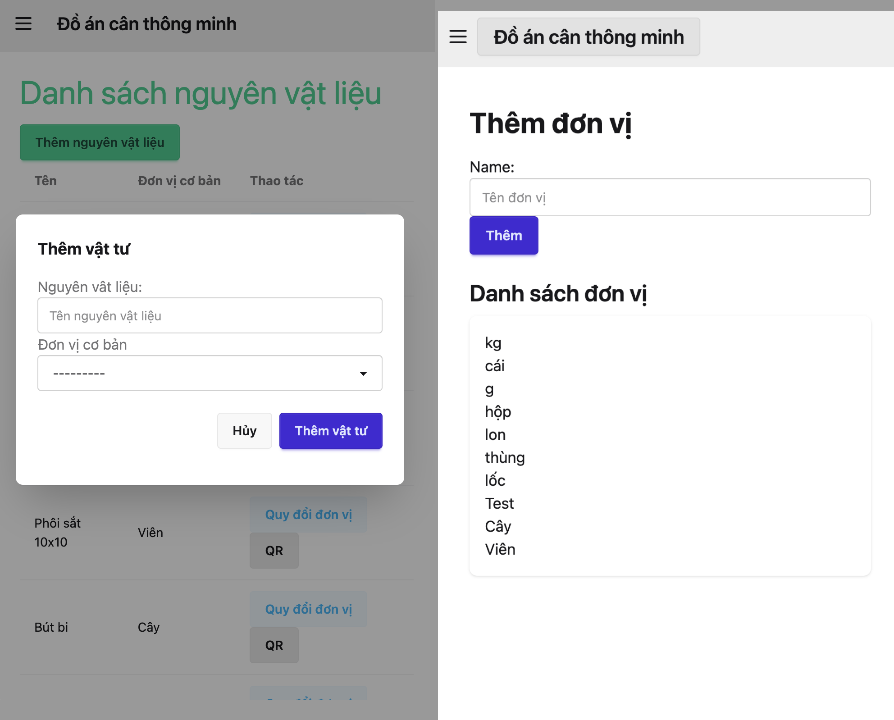
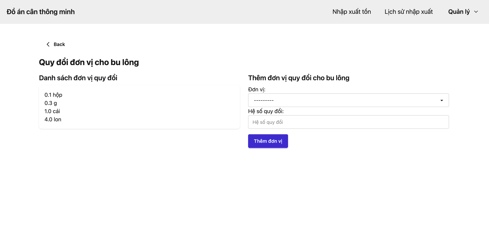
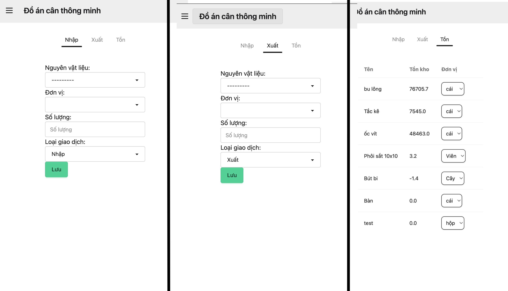
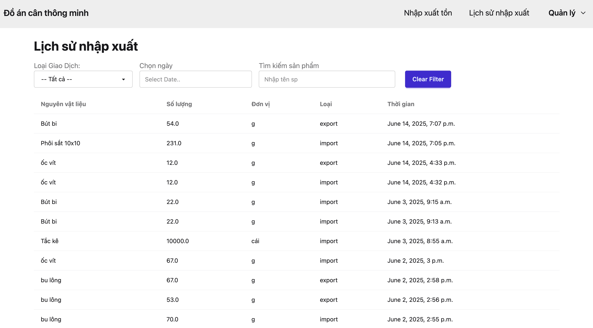
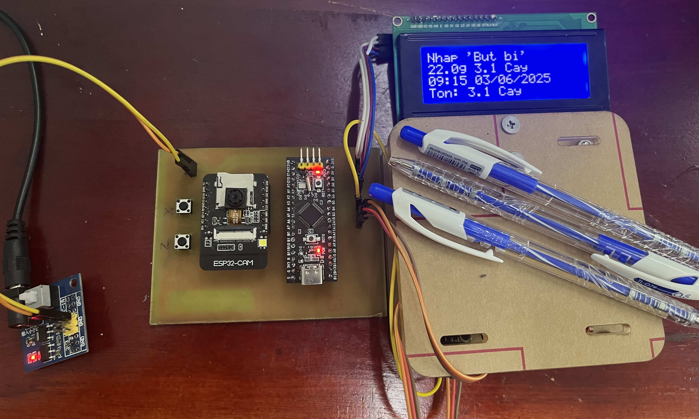

# 📦 Hệ thống Cân Thông Minh trong Quản Lý Kho

Hệ thống hỗ trợ **nhập – xuất – tồn vật tư nhỏ** dựa trên **khối lượng, mã QR và bảng quy đổi đơn vị**, thiết kế cho doanh nghiệp sản xuất.

## 🔧 Tính năng nổi bật

- Nhận dạng vật tư bằng mã QR (ESP32-CAM).
- Tự động quy đổi khối lượng sang số lượng theo định mức.
- Gửi dữ liệu nhập/xuất từ phần cứng lên phần mềm qua Wi-Fi.
- Cập nhật tồn kho khi nhấn nút "Nhập" hoặc "Xuất".
- Quản lý danh sách vật tư, đơn vị tính, định mức và lịch sử giao dịch.
- Giao diện web hiện đại, responsive (Django + HTMX + DaisyUI).

---

## 📁 Video demo

👉 [Xem trên YouTube](https://youtu.be/WrR_3SLUhm0)

---

## 🚀 Cài đặt & chạy dự án

### 1. Clone project

```bash
git clone git@github.com:vuongcris4/WMS_CanThongMinh.git
cd WMS_CanThongMinh
````

### 2. Khởi tạo và chạy PostgreSQL bằng Docker

```bash
docker run --name postgres-canthongminh \
  -e POSTGRES_DB=can_thong_minh \
  -e POSTGRES_USER=postgres \
  -e POSTGRES_PASSWORD=yourpassword \
  -p 5432:5432 \
  -d postgres
```

> ✅ *Lưu ý: Thay đổi `yourpassword` theo ý bạn.*

### 3. Tạo và kích hoạt môi trường ảo Python

```bash
python -m venv venv
source venv/bin/activate      # Linux/macOS
venv\Scripts\activate         # Windows
```

### 4. Cài thư viện phụ thuộc

```bash
pip install -r requirements.txt
```

### 5. Cấu hình `DATABASES` trong `settings.py`

```python
# settings.py
DATABASES = {
    'default': {
        'ENGINE': 'django.db.backends.postgresql',
        'NAME': 'can_thong_minh',
        'USER': 'postgres',
        'PASSWORD': 'yourpassword',
        'HOST': 'localhost',
        'PORT': '5432',
    }
}
```

### 6. Migrate database

```bash
python manage.py migrate
```

### 7. Chạy server Django

```bash
python manage.py runserver
```

➡️ Truy cập: [http://127.0.0.1:8000/](http://127.0.0.1:8000/)

---

## 🖼 Giao diện demo

### 🌐 Quản lý nguyên vật liệu


### ➕ Thêm đơn vị, thêm nguyên vật liệu



### 🔁 Quy đổi đơn vị tính



### 📥 Giao diện nhập - xuất - tồn kho



### 📊 Lịch sử nhập – xuất



### ⚙️ Phần cứng ESP32 + STM32 + LCD



---

## 📬 Liên hệ

📧 Email: [tranduyvuong100@gmail.com](mailto:tranduyvuong100@gmail.com)

